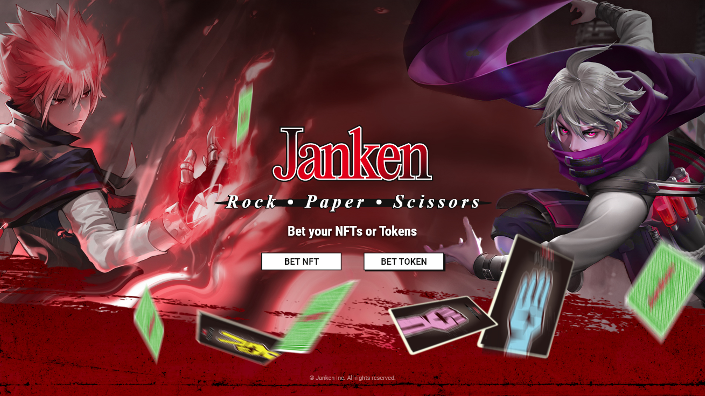
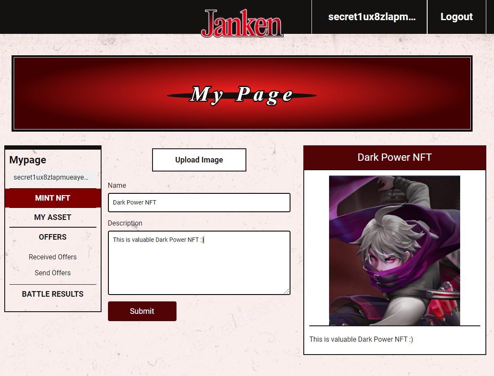
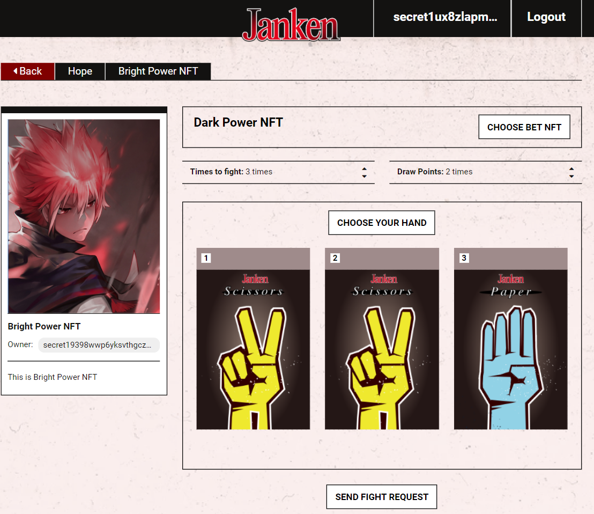
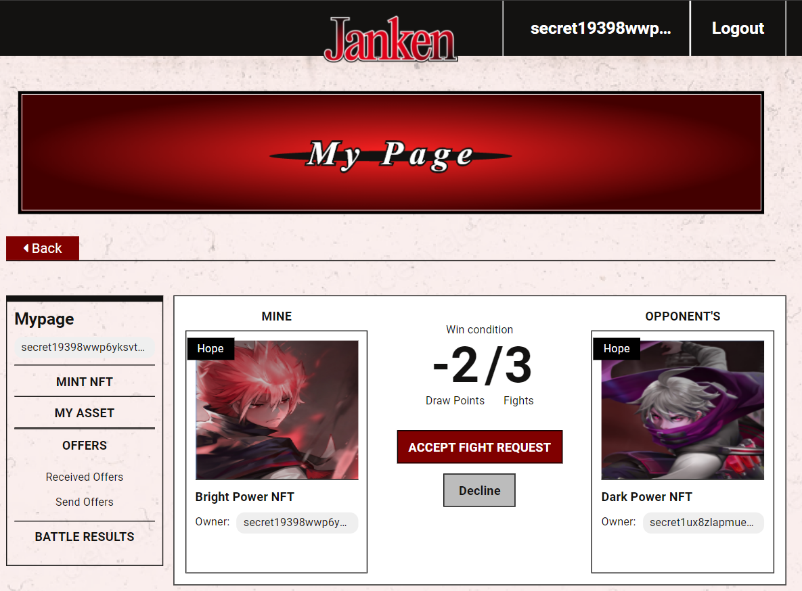
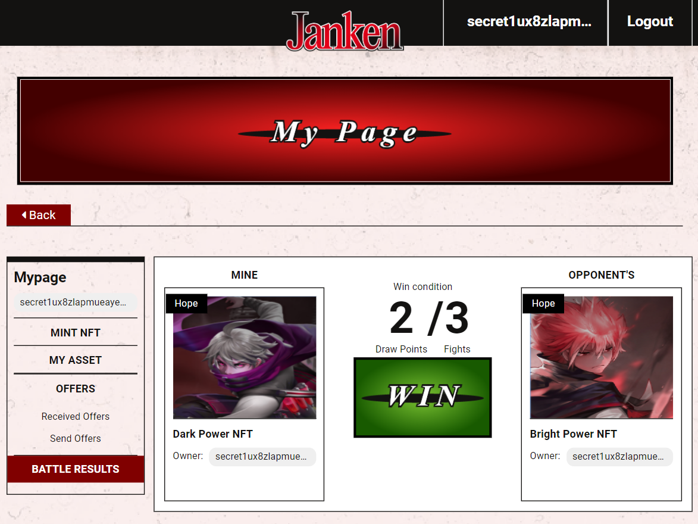
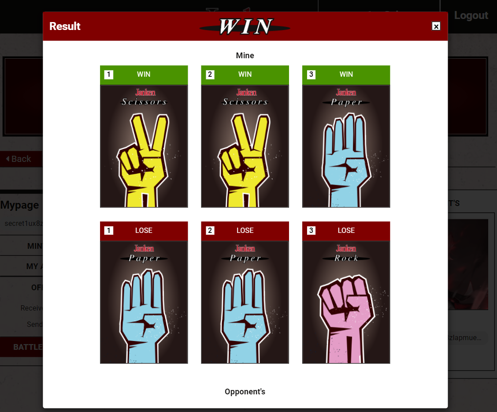

# janken-front

  

The web ui of Secret Janken Game Dapps.

live: http://janken.games

demo video: youtube link

## How to Play
**Pre Requirements**
- Install Keplr extension for browser
- Get some Secret Network Testnet token (`pulsar-1`) from [the official faucet site](https://faucet.secrettestnet.io/)

### BET NFT
1. Create Your Own NFT

  

Bob creates his own NFT by uploading an image and adding a name and description.

2. Send Battle Request

  

Bob sends out a Janken Battle Request, betting his NFT that he just minted and the attractive NFT Alice has.

|  status  |  points |
| -------- | ------- |
|  win     |   1     |
|  draw    |   0     |
|  lose    |  -1     |

According to the win points rule, winner gets 1 point, loser gets -1 point, and draws get 0 points. He thinks Alice's NFT is more valuable and sets draw points as 2 in 3 fights. It means Bob needs to win 3 times in a row to get Alice's NFT!

3. Accept Battle Request/Decline Battle Request

  

Alice notices Bob sent her a Janken Battle Request. She can choose to accept or decline the request. She finds draw point is -2 and it means that she only need to win or draw once in 3 fights in order to prevent her own NFT from being taken. She accepts the fight considering it is a very winnable fight.

4. Check Result

      

Immediately after Alice accepts the battle request, Bob and Alice's hands are matched on the contract and the results are revealed. In this case, fortunately, Bob won against Alice all three times. He has now acquired her NFT. Congratulations, Bob!

### BET TOKEN
1. Decide Bet Amount
2. Decide Secure Entropy
3. Decide Your Hand
4. Check Result

## reference
- [janken-contract](https://github.com/tak1827/janken-contract) CosmWasm Janken contract for Secrete Netork.
- [janken-api](https://github.com/tak1827/janken-front) Helper backend service to improve UX for Secret Janken Game.
